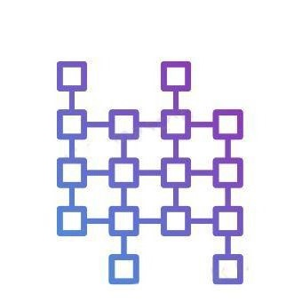

# OpenWallet
 
**Check Releases for apk.** 
[Releases](https://github.com/Abhimanyu121/OpenWallet/releases/tag/alpha1)
## Aim
Open wallet is an open source wallet with aim to bridge the gap between cryptocurrency world and common masses, it does so by reducing the complications of blockchain world and providing fiat like 
environment to the people in a highly secure way.
## Descriptionoyddpu
Open wallet currently have three layers of technology to make the user experience a lot better and we  have a lot of others in roadmap
1. Ropsten -In testing phase wallet uses ropsten as public ledger
2. Matic -It provides one click solution to users to get faster transactions and at almost zero transaction fee.
3. Moonpay - MoonPay is used as fiat to crypot interface for easy onboarding of new usrs.
 </t>__ To be added __
4. NuCypher - NuCypher's superior proxy rencryption to send extra data of transaction in secure and decentralized manner.
5. Torus( or Shamir's algorithm) - To have truly secure and decentralized way to safe guard keys without having users to worry about them.
 

## Features
- [x] Transacting/Sending Stable coins with Phone Number in a secure manner instead of using complex addresses.
- [x] Support for fast side chain(Matic) to make transactions safer and faster.
- [x] Use of stable Coins (currently custom tokens named moon are used as DAI is not available on ropsten, address is given at the end) to assure users that their funds will not be subjected to rate fluctuations.
- [x] Support for fiat to crypto interface with easy kyc.
- [x] Support to check transaction history using registered mobile number.
- [ ] Passing of extra information with transaction using nuCypher(This feature  will take a lot of time because of complex nature of nuCypher proxy re-encryption).
- [ ] Use of some login method like torus for easy accessiblity to the wallet.
- [ ] Using password protected qr code instead of mnemonics.
- [ ] Withdrawal to fiat(Can not be added before moving to main net.

## Our motivation behind our wallet application and  each feature

||
||
||

## Instructions to use 
1. After installing application Enter any phone number(OTP verification will be added in production), after this you can either put your pirvate key or generate new.
2. Go to info tab to get your newly generated address.
3. You can manually add eth or transfer moon tokens to the address or go to middle tab to perform kyc and add cards.
4. You can buy DAI(Moon token) using Moonpay interface.
5. In transactions tab you can transact using Main ropsten chain or matic chain after depositing tokens to it.
