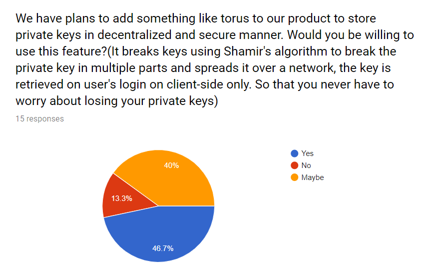

# OpenWallet
 
**Check Releases for apk.** 
[Releases](https://github.com/Abhimanyu121/OpenWallet/releases/download/Alpha2/app-release.apk)
## Use of Infura
- Email id `abhimanyushekhawat17.as@gmail.com`  
|
- Address to recieve bounty prize `0x7092Fdbc448698461A3ae98488C35568f368e0AD`
## Aim
Open wallet is an open source wallet with aim to bridge the gap between cryptocurrency world and common masses, it does so by reducing the complications of blockchain world and providing fiat like 
environment to the people in a highly secure way.
## Achievements
This project had been selected in Consensys labs relay program, it has won Consensys bounty of 10ETH (1800 USD)
## Description
Open wallet currently have three layers of technology to make the user experience a lot better and we  have a lot of others in roadmap
1. Ropsten - In testing phase wallet uses ropsten as public ledger
2. Matic - It provides one click solution to users to get faster transactions and at almost zero transaction fee.
3. Moonpay - MoonPay is used as fiat to crypot interface for easy onboarding of new usrs.
 </t>__ To be added __
4. NuCypher - NuCypher's superior proxy rencryption to send extra data of transaction in secure and decentralized manner.
5. Torus( or Shamir's algorithm) - To have truly secure and decentralized way to safe guard keys without having users to worry about them.
 

## Features
- [x] Transacting/Sending Stable coins with Phone Number in a secure manner instead of using complex addresses.
- [x] Support for fast side chain(Matic) to make transactions safer and faster.
- [x] Use of stable Coins (currently custom tokens named moon are used as DAI is not available on ropsten, address is given at the end) to assure users that their funds will not be subjected to rate fluctuations.
- [x] Support for fiat to crypto interface with easy kyc.
- [x] Support to check transaction history using registered mobile number.
- [ ] Passing of extra information with transaction using nuCypher(This feature  will take a lot of time because of complex nature of nuCypher proxy re-encryption).
- [ ] Use of some login method like torus for easy accessiblity to the wallet.
- [ ] Using password protected qr code instead of mnemonics.
- [ ] Withdrawal to fiat(Can not be added before moving to main net.

#### Side note 1: Application still have a lot of jagged edges, thus ping me on Telegram if you need some help. Telgram handle is @abhimanyu121
#### Side note 2: Buying crypto from moonpay takes time(you will have to complete kyc), so you can copy address from information tab and send some ether and Moon tokens directly to the address.
#### Side note 3: Application currently works only with moon tokens to demonstrate usablity of stable coins to gain user trust.
#### Side note 4: Please refrain from inputing exceptional inputs as it is still under development.
#### Side note 5: You can copy addresses and transaction hashes by tapping on them.
#### Important Note: You can send transactions to phone number: 8824505978 , It is linked with 0x2Ee331840018465bD7Fe74aA4E442b9EA407fBBE  address, you can scan this address on ropsten etherscan. Address of Moon token 0x48b0c1d90c3058ab032c44ec52d98633587ee711

## Pitch Deck
https://docs.google.com/presentation/d/1Myo8LKynOBocHy8WZS6cGNNxnzbyWDBkSaSSwz_2KeU/edit?usp=sharing
## Market Research
https://docs.google.com/document/d/1xm8WNsQd0XCwPNxJAfxLSfZTyXjMIz36o3DcMoGmtiY/edit?usp=sharing
## Screenshots
||
||
||
||

## Our motivation behind our wallet application and  each feature

||
||
||

